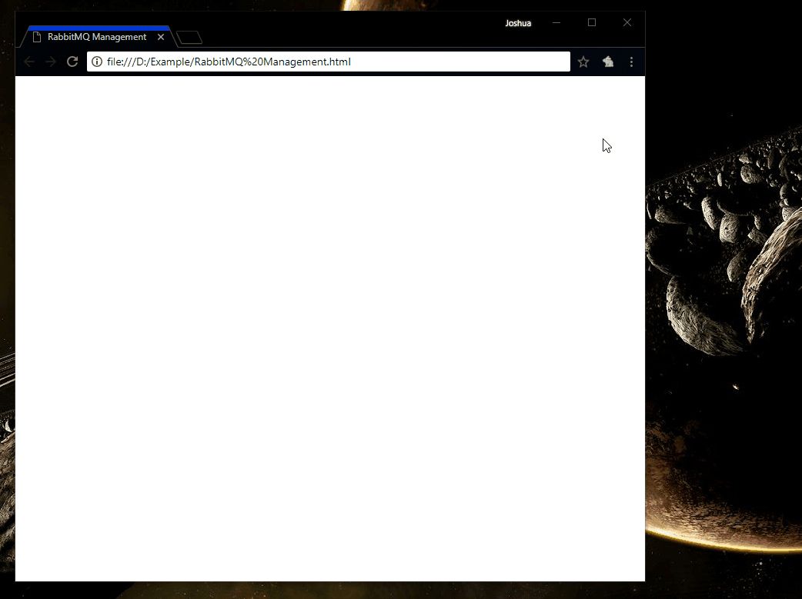

# 🐇 Rabtifier 🐇

Why that name? Put RabbitMQ and Prettifier together and, well, you may come out with Rabtifier. Or RabbitMQtifier. Or RMQtifier.

# What is it?

A Chrome Extension! I was tired of copy+pasting and formatting the JSON that may be present on some RabbitMQ screens into other applications.

# Where do I find it?

You can find the beta version of this plugin in the Chrome Web Store at https://chrome.google.com/webstore/detail/rabtifier-rabbit-message/icdhnccmbhkngaibccagohbfibdihbga

(technically speaking, the reason you could not find it is that it's unlisted)

# It does not appear to work on local copies of web pages...

Did you enable access to file URLs? To do so, just follow along with the Gif below or look it up.

# It kind of is not the most useful...

True, thanks for putting that so nicely. This really came about more from wanting to learn something new over [the course of 2 hours][pluralsight] (gosh I love Pluralsight) than a desire to create a fully fledged extension. The addition of more functionality depends on the amount that I use the management screens of RabbitMQ, and the amount that of time that I have left over after my other projects.

 [pluralsight]: https://app.pluralsight.com/library/courses/creating-chrome-extensions/table-of-contents